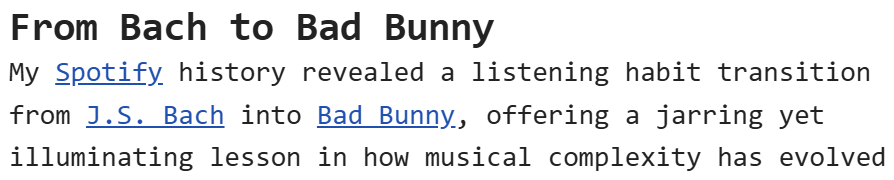
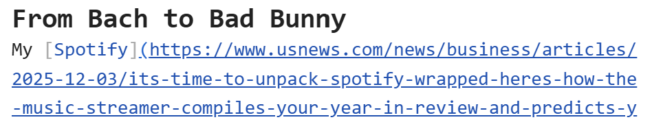
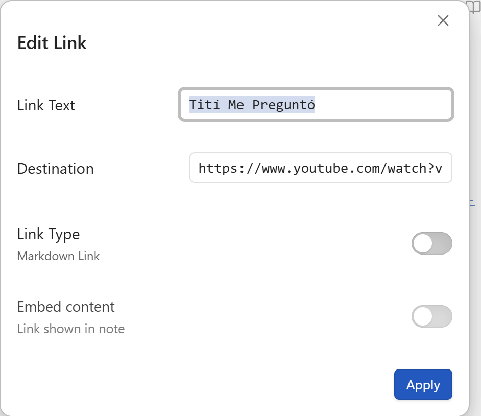
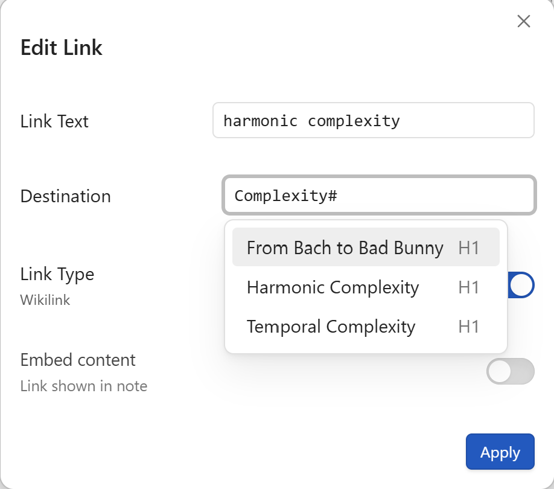

# Steady Links

When you arrow-key through a note in stock Obsidian, every link you touch springs open to reveal its raw syntax: brackets, URLs, everything.

Your cursor jumps, your place in the text shifts, and if the link is long, you can end up lines away from the link text you may or may not have wanted to change.

### What Steady Links Does

**Links stay put.**
Enable `Keep links steady` in this plugin's settings, and links in Live Preview stop expanding when your cursor enters them. You see only the link text -- which you can edit normally -- while the underlying link syntax and destination stay out of your way (similar to gmail). For an old school syntax check, see the [Steady Links Commands](#steady_links_commands)

#### Link Editor: links without juggling brackets

The `Edit Link` command opens a modal where you can change any link syntax. You can set the link text, and make the link destination a URL, file, heading, or block reference. You can set the link type to wikilink or markdown format, and chose to embed the link content in your page. No hand-editing. No mismatched brackets.

##### Link Editor Autocompletes

Convenient link text and destination autocompletes make the job easier:

Autocomplete works for both link destination and link text fields. In wikilink mode, there are autocomplets **Destination** field like the standard obsidian `[[` operator: files in your vault, headings within notes, and block references. you can type patterns like `Note#Heading` or `Note#^block` to jump directly to a heading or block in a specific note, or start with `#` / `^` to target headings and blocks in the current note. If your cursor is on a URL, or if your clipboard contains one, it will be put in the destination field and adjusted as needed.

CHECK PLUGIN AUTOCOMPLETE WHEN WIKILINK IN CLIBPOARD
CHECK TO SEE ALIASES REALLY WORK

The **Link Text** field will autocomplete to selected text when you have a URL in your clipboard or at your cursor. For wikilinks, Matching note aliases from frontmatter are also included, and when you pick an alias suggestion the link still points to the real note. When you choose a note alias in the destination suggestions, the modal can automatically use that alias as the visible link text so you do not have to copy it by hand.

## Steady Links Commands

Commands for opening the link editor, and for easier link manipulation if you happen to prefer Obsidian's default link expanding behavior (`Keep links steady` setting is `false`)

| Command                | Description                                                             | Suggested Hotkey | ID                                |
| ---------------------- | ----------------------------------------------------------------------- | ---------------- | --------------------------------- |
| **Edit Link**          | Open the link editor modal for the link at cursor, or create a new link | Ctrl + K         | `steady-links:edit-link`          |
| **Skip Link**          | Moves the cursor past the current link, avoiding link syntax navigation | Alt + K          | `steady-links:skip-link`          |
| **Toggle Link Syntax** | Toggle between shown and hidden link syntax (Live Preview)              | Ctrl + Shift + L | `steady-links:toggle-link-syntax` |
| **Show Link Syntax**   | Temporarily reveals the full raw link at the cursor (Live Preview)      | Alt + S          | `steady-links:show-link-syntax`   |
| **Hide Link Syntax**   | Collapses the link syntax back to only link text (Live Preview)         | Alt + H          | `steady-links:hide-link-syntax`   |

## Editing Policy for Hidden Links

When **Keep links steady** is on, the visible link text behaves like a protected inline token—similar to editing a linked chip in Gmail.

- Typing **inside** the visible link text edits the visible text.
- Typing at the **left edge** of the visible link inserts **before** the entire link, not into the first character of the link text.
- Typing at the **right edge** of the visible link inserts **after** the entire link.
- If you want to change the hidden parts of the link—destination, alias boundaries, wiki-vs-markdown format, embed state—use **Edit Link** instead of typing through the hidden syntax.

This is intentional. The goal is to make hidden links feel stable and predictable: edge typing goes outside the link, while changes to the link's structure go through the link editor.

## Getting Started

Install the plugin, then open Settings → Steady Links.

Turn on **Keep links steady**. That's it—links in Live Preview will no longer expand when you cursor into them. Navigate your notes in peace.

When you need to change where a link points, put your cursor on it and run **Edit Link** from the Command Palette (`Ctrl/Cmd + P`). The modal opens pre-filled with the current link's details. Change what you need, hit `Enter`, and you're done.

## The Edit Link Modal

When you run `Edit Link` with your cursor on an existing Markdown link or WikiLink, the modal opens with that link's current text, destination, format, and embed state already filled in.  

Otherwise, the modal opens with convenient defaults for a new link.  These are based on your selection, clipboard, and cursor position.

### Defaults For New Links

| Condition                                   | Link Text                | Destination                     | Format   | Notes                                                               |
| ------------------------------------------- | ------------------------ | ------------------------------- | -------- | ------------------------------------------------------------------- |
| Cursor on a bare URL                        | Original URL text        | Normalized URL                  | Markdown | Ignores plain-text clipboard content; the URL under the cursor wins |
| Selection is a URL                          | Original URL text        | Normalized URL                  | Markdown | `www.` URLs are normalized to `https://...`                         |
| Has selection + clipboard has URL           | Selection                | Normalized URL                  | Markdown | Useful for turning selected text into an external link              |
| Has selection + clipboard has full wiki link     | Selection                | Destination from clipboard link | WikiLink | Uses the clipboard link destination, not its display text           |
| Has selection + clipboard has full markdown link | Selection                | Destination from clipboard link | Markdown | Uses the clipboard link destination, not its display text           |
| Has selection + clipboard has plain text    | Selection                | Clipboard text                  | WikiLink | Plain clipboard text becomes the destination unchanged              |
| Has selection + clipboard empty             | Selection                | _(empty)_                       | WikiLink | Good starting point for a new internal link                         |
| No selection + clipboard has URL            | Normalized URL           | Normalized URL                  | Markdown | Link text is preselected so you can replace it quickly              |
| No selection + clipboard has wiki link      | Text from clipboard link | Destination from clipboard link | WikiLink | Reuses both text and destination from the clipboard link            |
| No selection + clipboard has markdown link  | Text from clipboard link | Destination from clipboard link | Markdown | Reuses both text and destination from the clipboard link            |
| No selection + clipboard has plain text     | _(empty)_                | _(empty)_                       | WikiLink | Plain clipboard text is ignored to avoid stale autofill             |
| No selection + empty clipboard              | _(empty)_                | _(empty)_                       | WikiLink | Opens as a blank internal-link draft                                |

**Notes:**

- When the cursor is on an existing link, the modal is pre-filled from that link instead of defaults.
- A bare URL means plain text like `www.example.com` or `https://example.com` that is under the cursor and not already part of a link.
- URL normalization ensures a working link destination: plain `www.` URLs are prepended with `https://`
- When there is a selection and the clipboard contains plain text that is not a link or URL, the clipboard contents are used as the destination.

**Editing an existing link:** Cursor onto any link and run _Edit Link_. The modal shows the current text, destination, link type (Wiki or Markdown), and embed status. Change anything, hit `Enter`.

**Suggestions:** As you type in the Destination field, you get autocomplete for:

- **Files** in your vault (with path disambiguation)
- **Headings** within a file (type `#` after a filename)
- **Block references** (type `^` after a filename)

Tab accepts the current suggestion. `Ctrl+N`/`Ctrl+P` navigate the list.

| Command                | What It Does                                                                                    |
| ---------------------- | ----------------------------------------------------------------------------------------------- |
| **Skip Link**          | Jumps the cursor past the current link. Handy when a link expands and you just want to move on. |
| **Hide Link Syntax**   | Collapses the link at your cursor back to its display text.                                     |
| **Show Link Syntax**   | Reveals the full syntax of the link at your cursor.                                             |
| **Toggle Link Syntax** | Flips between shown and hidden. One hotkey for both directions.                                 |

These commands work in Live Preview mode. In Source mode, syntax is always visible, so they're not needed; **Edit Link** is the only tool you need.

> **Tip:** Bind _Toggle Link Syntax_ to a hotkey for quick peeking at link destinations without opening the modal. Bind _Skip Link_ if you keep "Keep links steady" off but want a fast escape hatch when a link expands.

## Use Cases

**"I navigate by keyboard and links keep jumping around."**
Turn on "Keep links steady." Endit link text like any other text. Options below make the rest easier.

**"I want to edit link destinations without wrestling with bracket syntax."**
Use _Edit Link_. The modal handles formatting, suggests files and headings, and validates your input.

**"I like the default link-expanding behavior, but sometimes I want to collapse a link quickly."**
Leave the setting off. Use _Hide Link Syntax_ or _Toggle Link Syntax_ when you need a link to settle down.

**"I have a URL on my clipboard and want to turn selected text into a link."**
Select the text, run _Edit Link_. The URL is pre-filled from your clipboard.

## Settings

| Setting           | Default | Description                                                                                                                                   |
| ----------------- | ------- | --------------------------------------------------------------------------------------------------------------------------------------------- |
| Keep links steady | Off     | Prevent links from expanding when the cursor enters them in Live Preview. Link text remains editable; use _Edit Link_ to change destinations. |

## Compatibility

- Works in **Live Preview** and **Source** mode
- Supports **WikiLinks** (`[[destination]]`) and **Markdown links** (`[text](url)`)
- Supports **embeds** (`![[file]]` and ``)
- Requires Obsidian **1.9.0** or later

## License

MIT
