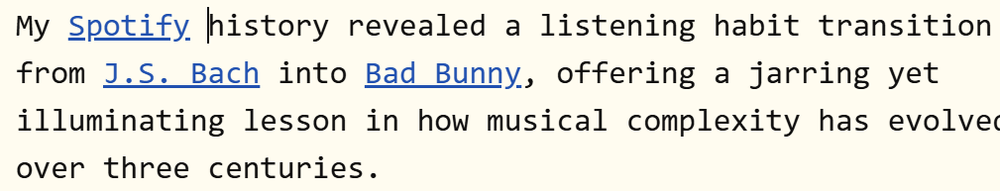
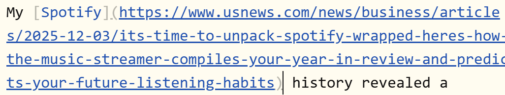
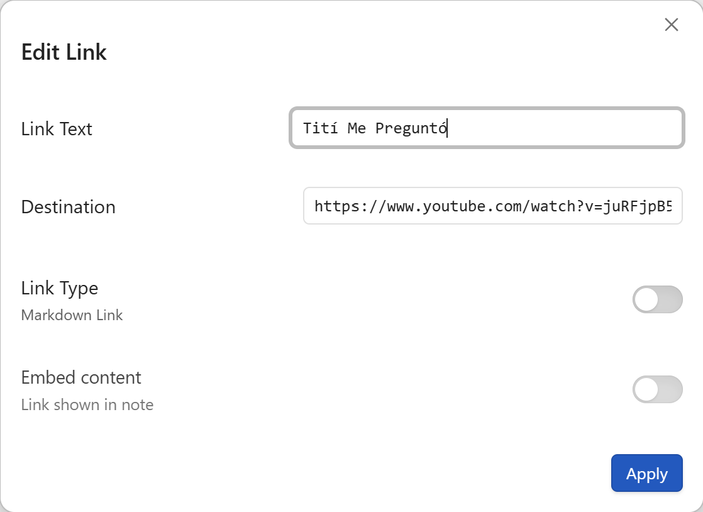
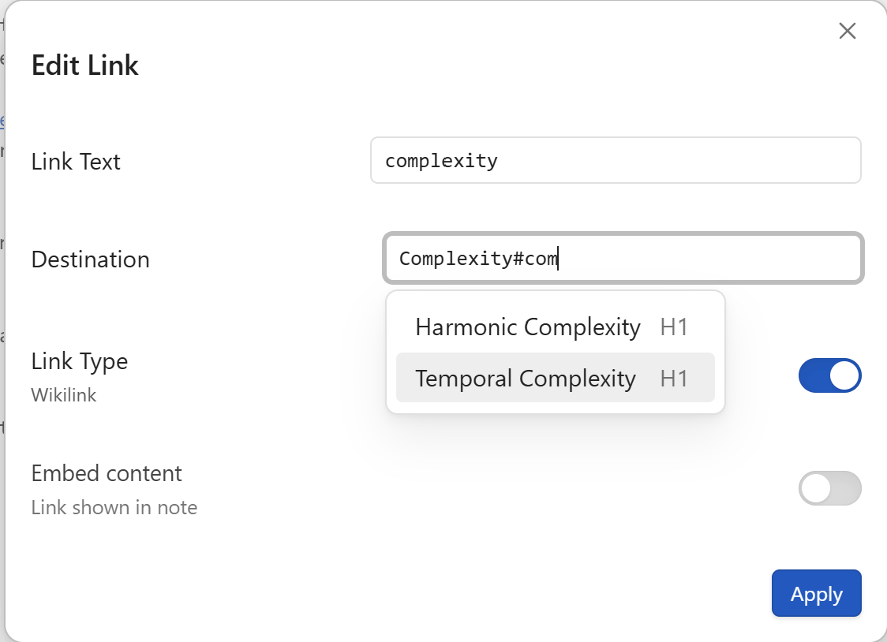

# Steady Links

[](https://github.com/notuntoward/obsidian-steady-links/actions/workflows/build.yml)
[](https://github.com/notuntoward/obsidian-steady-links/actions/workflows/codeql.yml)
[](https://github.com/notuntoward/obsidian-steady-links/actions/workflows/scorecard.yml)
[](https://securityscorecards.dev/viewer/?uri=github.com/notuntoward/obsidian-steady-links)

Steady Links keeps your links steady in Live Preview—hiding raw syntax while you navigate—and provides a keyboard-friendly link editor and other useful utilities.

---

### Stock Obsidian Links

When you arrow-key through a note in stock Obsidian, every link you touch expands, exposing its raw syntax: brackets, URLs, everything.

<div style="display: flex; justify-content: center; gap: 1rem; margin: 1.5rem 0;">
  <figure style="margin: 0; text-align: center;">
    
    <figcaption>Link collapsed</figcaption>
  </figure>
  <figure style="margin: 0; text-align: center;">
    
    <figcaption>Link expanded</figcaption>
  </figure>
</div>

In stock Obsidian, link expansion can interrupt keyboard navigation: touching a link—whether you intended to edit it or simply move past it—can suddenly shift the line layout and push your cursor lines away. Keyboarding through long URLs and manually wrestling with brackets, pipes, and percent-encoding is tedious and error-prone.

---

## Core Functionalities

### 1. Keeps Links Steady

Enable **Keep links steady** in the plugin settings, and links in Live Preview stop expanding when your cursor touches or moves through them:

- **Clean, folded display**: Only the link's display text is shown. The underlying syntax (`[[...]]`, `|`, `[...](...)`, `![...]`) is hidden behind zero-width inline decorations that do not disrupt editor line metrics.
- **Natural arrow navigation**: Arrow keys move smoothly across the visible link text. When reaching either boundary of the link, a single arrow press skips cleanly past the hidden syntax to the adjacent text.
- **Symmetric boundary traversal**: Moving forward out of a link lands cleanly before any following space character; moving backward into the link lands on the last character of visible link text without skipping characters.
- **Soft-wrap and line-end stability**: Pressing the `End` key, `Shift+End`, or Emacs `moveToEnd` on soft-wrapped lines stops properly at the visual wrap boundary instead of bouncing past hidden trailing syntax onto the next line.
- **Home key awareness**: Pressing `Home` on a line containing or starting with a link navigates reliably to the line start or the start of the visible link text.

### 2. Inline Editing Policy for Hidden Links

When **Keep links steady** is enabled, visible link text behaves like a stable inline token:

- **Typing inside visible text**: Directly edits the visible link text.
- **Automatic bare wikilink conversion**: If you edit the text of a bare wikilink (e.g. `[[My Note]]`), Steady Links automatically converts it into an aliased link (e.g. `[[My Note|My Note Edited]]`) so your note target remains intact.
- **Typing at the left edge**: Inserts text **before** the entire link, not into the first character of the link text.
- **Typing at the right edge**: Inserts text **after** the entire link, outside the link markup.
- **Enter at link end**: Pressing `Enter` at the trailing boundary inserts a newline **after** the link outside the link syntax.
- **Deleting text**: Backspace and Delete within the link text edit the visible text normally. Deleting an entire link selection cleanly removes the whole link.
- **Clipboard and copy protection**: Copying text that spans across links strips hidden trailing syntax so the clipboard receives clean text. Copying full links preserves proper link markup, and pasting prevents duplicate bracket corruption.
- **Structural link edits**: To change the link destination, switch between wikilink and markdown formats, or toggle embed state, use the **Edit link** command (`Ctrl/Cmd + K`).

### 3. Link Shortening Options

For notes with long heading paths or deep folder hierarchies, Steady Links offers optional display shortening (matching the clean aesthetic of plugins like *Short Links* while keeping links steady under the cursor):

- **Shorten heading and block links**: In unaliased links like `[[Note#Heading]]` or `[[Note#^block-id]]`, hides the note path and `#`/`#^` markers, displaying only `"Heading"` or `"block-id"`.
- **Shorten file links**: In unaliased file links like `[[folder/subfolder/Note]]`, hides the parent folder path, displaying only `"Note"`.
- **Steady under cursor**: Unlike third-party display plugins that expand when focused, links stay shortened and steady even with the cursor on the link.

*(Both options require **Keep links steady** to be enabled.)*

### 4. In-Editor `[[` Autocomplete

When **Keep links steady** is enabled, Steady Links provides its own high-priority editor suggestion popup for `[[`:

- **Flicker-free completion**: Completely replaces Obsidian's built-in `[[` suggest without triggering syntax expansion.
- **Rich suggestions**: Suggests vault files, frontmatter note aliases, headings, and block references.
- **In-place completion with `Tab`**: Pressing `Tab` completes the currently highlighted suggestion into the document while keeping the suggestion popup open for further refinement (flashes if already complete).
- **Heading search mode with `#`**: Typing `#` completes the highlighted file name and instantly switches to searching headings in that note. (Typing `#` before any file name searches headings in the *current* note).
- **Block search mode with `^`**: Typing `^` completes the highlighted file name and switches to searching block references in that note. (Typing `^` before any file name searches blocks in the *current* note).
- **Unresolved links with `Shift+Enter`**: Inserts a link to the literally typed text (e.g. `[[Unwritten Note]]`), even if no matching file exists.
- **Alias selection**: Choosing a note alias automatically inserts `[[Note|Alias]]` with the alias text pre-selected for quick editing.

### 5. Clicking and Following Links

- **Clicking into links with the mouse**: In Live Preview, clicking on a link places the text cursor inside the visible link text for editing—without expanding the link.
- **Following links with the mouse**: Use Obsidian's standard link-following gesture: **Ctrl+Click** (Windows/Linux) or **Cmd+Click** (macOS) to follow the link and open the target note. (In Reading view, a plain click follows the link).
- **Following links with the keyboard**: Use Obsidian's native **Open link under cursor** command (default hotkey **Alt+Enter**, or customizable in Obsidian Settings → Hotkeys). You can also use **Open link under cursor in new tab** (`Ctrl/Cmd + Alt + Enter`) or **Open link under cursor to the right**.
- **Opening in default external applications**: Use Steady Links' **Open link in default app** command to open web URLs in your system default web browser, or linked files (e.g. PDFs, images) in their default OS desktop applications.
- **Revealing in file explorer**: Use Steady Links' **Reveal link in file explorer** command to locate linked vault files or local files in Windows File Explorer, macOS Finder, or Linux file manager.

---

## The Edit Link Modal

<figure style="float: right; width: 50%; margin: 0 0 1rem 1.5rem; text-align: center;">
  
  <figcaption>Link editor (markdown link)</figcaption>
</figure>

The **Edit link** command (`Ctrl+K` / `⌘K`) opens an interactive modal to edit the link under the cursor or create a new link from your current selection, clipboard, or cursor position.

No hand-editing raw markdown syntax. No mismatched brackets. No manual percent-encoding.

### Modal Controls & Features

- **Link Text**: The visible label of the link.
- **Destination**: The target of the link—a note, heading, block reference, web URL, custom URI scheme (`onenote:`, `vscode://`, `obsidian://`), or local file path.
- **Link Type (Segmented Control)**:
  - Quickly switch between **Wikilink** (`[[...]]`) and **Markdown** (`[...] (...)`).
  - **Automatic syntax conversion**: When switching from Wikilink to Markdown, spaces and special characters are automatically percent-encoded (e.g. ` ` → `%20`, `(` → `%28`, `)` → `%29`, `^` → `%5E`). When switching to Wikilink, percent-encoding is cleanly decoded.
  - **Smart URL detection**: Entering a web URL automatically sets the link type to Markdown.
  - **Bare-domain note hint**: If a destination looks like a web domain (e.g. `community.cloud.databricks.com`) but matches an existing note in your vault, the modal displays a one-click hint to keep it as a Wikilink note target.
  - **Keyboard navigation**: Roving `Tab` stop on the active button; `ArrowLeft` / `ArrowRight` switches and activates; `Space` cycles between Wikilink and Markdown; `Enter` submits.
- **Embed Content Toggle**:
  - Toggles whether the link is embedded (`![[...]` or ``), displaying the content inline.
  - Keyboard accessible: `Space` toggles without submitting; `Enter` submits without toggling.
- **Real-Time Validation & Safety Hints**:
  - Warns about invalid characters in wikilink filenames (`< > ( ) | ^ : %% [[ ]] * " ? \`).
  - Validates block reference syntax (`#^[a-zA-Z0-9-]+`).
  - Detects self-embed loops (embedding a note into itself).
  - Displays non-blocking notices when URLs or clipboard values are normalized.

<div style="clear: both;"></div>

### Destination Autocomplete

<figure style="float: right; width: 50%; margin: 0 0 1rem 1.5rem; text-align: center;">
  
  <figcaption>Destination autocompletion</figcaption>
</figure>

As you type in the Destination field, the modal provides real-time suggestions:

- **Vault notes**: Notes across your vault, with folder path disambiguation when note names overlap.
- **Note aliases**: Matches frontmatter aliases; selecting an alias targets the underlying file and automatically fills the Link Text field with that alias.
- **Headings within notes**: Type `Note#Heading` or `#Heading` to search headings in a specific note or the current note.
- **Block references**: Type `Note#^block` or `^block` to target block references.
- **Global headings**: Type `##` to search headings across all notes in the vault.
- **Unresolved links**: Suggestions include referenced notes that haven't been created yet.

**Keyboard shortcuts in suggestions**:
- `ArrowUp` / `ArrowDown` or `Ctrl+N` / `Ctrl+P` (`⌘N` / `⌘P` on macOS) to navigate suggestions.
- `Tab` or `Enter` to accept the highlighted suggestion.
- `Escape` closes the suggestion list.

<div style="clear: both;"></div>

### Smart Defaults for New Links

When creating a new link, the modal intelligently pre-fills fields based on your text selection, clipboard contents, and cursor location:

| Condition | Link Text | Destination | Format | Behavior / Notes |
| :--- | :--- | :--- | :--- | :--- |
| **Cursor on a bare URL** | Original URL text | Normalized URL | Markdown | Pre-selects text for fast replacement; normalizes `www.` to `https://` |
| **Cursor on a bare file name** | File name | File name | WikiLink | Bounded token matching an existing vault file (e.g. `diagram.canvas`) |
| **Selection is a URL** | Original URL text | Normalized URL | Markdown | Normalizes `www.` to `https://` |
| **Selection + clipboard has URL** | Selected text | Normalized URL | Markdown | Converts selected prose into a web link |
| **Selection + clipboard has custom URI** | Selected text | Custom-scheme URI | Markdown | Supports `onenote:`, `vscode://`, `obsidian://`, etc. |
| **Selection + clipboard has file path** | Selected text | File path | Markdown | Windows (`C:\…`), macOS/Linux (`/…`), UNC (`\\…`); quotes stripped |
| **Selection + clipboard has wikilink** | Selected text | Destination from link | WikiLink | Extracts destination from clipboard wikilink |
| **Selection + clipboard has markdown link**| Selected text | Destination from link | Markdown | Extracts destination from clipboard markdown link |
| **Selection + clipboard has plain text** | Selected text | Clipboard text | WikiLink | Plain text becomes the destination |
| **Selection + clipboard empty** | Selected text | _(empty)_ | WikiLink | Focuses destination field with autocomplete ready |
| **No selection + clipboard has URL** | Normalized URL | Normalized URL | Markdown | Link text is pre-selected for quick renaming |
| **No selection + clipboard has custom URI**| Custom-scheme URI | Custom-scheme URI | Markdown | Link text is pre-selected for quick renaming |
| **No selection + clipboard has file path** | File path | File path | Markdown | Link text is pre-selected for quick renaming |
| **No selection + clipboard has wikilink** | Text from link | Destination from link | WikiLink | Reuses both text and destination from clipboard |
| **No selection + clipboard has markdown link**| Text from link | Destination from link | Markdown | Reuses both text and destination from clipboard |
| **No selection + clipboard has plain text**| _(empty)_ | _(empty)_ | WikiLink | Plain clipboard text is ignored to prevent stale autofill |
| **No selection + empty clipboard** | _(empty)_ | _(empty)_ | WikiLink | Opens as a blank draft ready for typing |

---

## Commands Reference

Steady Links registers 8 commands to streamline link editing, navigation, and inspection:

| Command | Description | Suggested Hotkey (Win / macOS) | Command ID | Mode Support |
| :--- | :--- | :--- | :--- | :--- |
| **Edit link** | Opens the modal to create a link or edit the one at cursor | `Ctrl+K` / `⌘K` | `steady-links:edit-link` | Live Preview & Source |
| **Skip Link** | Jumps the cursor past the current link | `Alt+S` / `⌥S` | `steady-links:skip-link` | Live Preview & Source |
| **Toggle Link Expand** | Toggles between expanded syntax and steady collapsed display | `Alt+T` / `⌥T` | `steady-links:toggle-link-expand` | Live Preview |
| **Expand Link** | Temporarily reveals full raw syntax of link at cursor | `Alt+E` / `⌥E` | `steady-links:expand-link` | Live Preview |
| **Collapse Link** | Collapses expanded link at cursor back to display text | `Alt+C` / `⌥C` | `steady-links:collapse-link` | Live Preview |
| **Open link in default app** | Opens link destination in OS default application or browser | — | `steady-links:open-link-in-default-app` | Desktop only (all modes) |
| **Reveal link in file explorer**| Reveals linked file in OS file explorer (Finder / Explorer) | — | `steady-links:reveal-link-in-explorer` | Desktop only (all modes) |
| **Copy link to current note** | Copies a wikilink to the active note to the clipboard | — | `steady-links:copy-link-to-current-note` | All modes |

### Command Details

- **Edit link**:
  - On an existing link: Opens the modal pre-filled with the current link's text, destination, format, and embed state.
  - When no link is selected: Opens the modal with smart defaults based on your current selection, clipboard, or cursor.
  - Cursor behavior upon closing: When **Keep links steady** is on in Live Preview, your cursor stays directly on the link; in Source mode or when steady links are off, the cursor skips off the link to prevent stock Obsidian from expanding it.
- **Skip Link**:
  - Intelligently skips past the link based on cursor position (if nearer the start, skips forward past the link; if nearer the end, skips backward before the link).
  - Works in both Live Preview and Source mode.
  - Excellent as an escape hatch when **Keep links steady** is turned off and a link expands under your cursor.
- **Expand Link / Collapse Link / Toggle Link Expand**:
  - Provides on-demand syntax peeking when **Keep links steady** is enabled.
  - **Expand Link** temporarily reveals the raw markdown syntax so you can inspect brackets, URLs, or anchors without opening a modal.
  - **Collapse Link** folds it back down.
  - **Toggle Link Expand** binds both actions to a single hotkey (`Alt+T`). If steady links are disabled, it acts like *Collapse Link* to skip off the link and settle it down.
- **Open link in default app**:
  - Web URLs (`https://`, `http://`, `www.`) open in your system default browser.
  - Linked vault files (e.g. `[[manual.pdf]]`, `[[image.png]]`) or absolute file paths (`C:\...`, `/...`) open in their associated OS applications (external PDF reader, media player, etc.).
- **Reveal link in file explorer**:
  - Locates the linked note or asset file on disk and selects it in Windows File Explorer, macOS Finder, or Linux file manager.
- **Copy link to current note**:
  - Generates a clean wikilink to the active note (e.g. `[[Folder/My Note]]` or `[[diagram.canvas]]`) and copies it to your clipboard.
  - Can also be accessed via the tab header context menu (see [Settings](#settings)).

---

## Use Cases

### "I navigate by keyboard and links keep jumping around."
Turn on **Keep links steady**. Live Preview links will never expand under your cursor again. Arrow through your notes, wrap across lines, and read uninterrupted.

### "I want to edit link destinations without wrestling with bracket syntax."
Press `Ctrl+K` (or `⌘K`). The **Edit link** modal lets you change link text, pick destinations with autocomplete, toggle embeds, and switch formats without worrying about mismatched brackets or broken syntax.

### "I have a URL on my clipboard and want to turn selected text into a link."
Highlight your text and press `Ctrl/Cmd + K`. The modal opens with your selected text as the link text and the clipboard URL as the destination. Hit `Enter` to apply.

### "I want to convert between Wikilinks and Markdown links."
Open **Edit link** on any link and switch the segmented control between **Wikilink** and **Markdown** (using mouse click, `ArrowLeft` / `ArrowRight`, or `Space`). Destination paths and URLs are automatically encoded or decoded.

### "I want to peek at link destinations quickly without opening the modal."
Bind `Alt+T` to **Toggle Link Expand**. Press it to reveal the raw syntax of the link under your cursor, inspect the destination, and press it again to collapse it back.

### "I like Obsidian's default link expansion, but want an escape hatch when a long link blows up."
Leave **Keep links steady** off and bind `Alt+S` to **Skip Link**. Whenever a link expands under your cursor, press `Alt+S` to jump past it in one keystroke.

### "I want to open linked PDFs or external files in native desktop apps."
Place the cursor on the link and run **Open link in default app** from the command palette or a custom hotkey to open the file in your preferred PDF viewer or media player.

### "I want to locate a linked file on my computer's drive."
Run **Reveal link in file explorer** on any vault file link to highlight it in Finder or Windows Explorer.

### "I want cleaner heading and subfolder links in my notes."
Enable **Shorten heading and block links** and **Shorten file links** in settings. Links like `[[Deep/Folder/Topic]]` display as `"Topic"` and `[[Guide#Installation]]` display as `"Installation"`, even while typing on them.

### "I want to quickly share or cross-reference my active note."
Run **Copy link to current note** or right-click the note's tab header to copy its wikilink to the clipboard.

---

## Settings

| Setting | Default | Description |
| :--- | :--- | :--- |
| **Keep links steady** | `Off` | Keeps links collapsed to display text when entered by cursor in Live Preview. Underlying syntax remains hidden. |
| **Shorten heading and block links** | `Off` | Hides note path and `#`/`#^` markers in unaliased links (e.g. `[[Note#Heading]]` → `"Heading"`), even with cursor on the link. *(Requires Keep links steady).* |
| **Shorten file links** | `Off` | Hides parent folder path in unaliased file links (e.g. `[[folder/Note]]` → `"Note"`), even with cursor on the link. *(Requires Keep links steady).* |
| **Show Copy link to current note in tab menu** | `Off` | Adds a "Copy link to current note" option to the right-click context menu of editor tab headers. |

---

## Compatibility

- **Modes**: Fully compatible with **Live Preview** and **Source** modes.
- **Link formats**: Supports **WikiLinks** (`[[destination]]`, `[[destination|display text]]`), **Markdown links** (`[display text](destination)`), and **Embeds** (`![[...]`, ``).
- **Platform support**: Works on desktop and mobile. (Desktop-specific commands: *Open link in default app* and *Reveal link in file explorer*).
- **Requirements**: Obsidian **1.9.0** or later.

---

## Testing & Quality Assurance

Steady Links maintains an extensive, regression-tested test suite:

- **Unit & Integration tests (Vitest)**: Over 1,100 automated tests covering parsing, transaction filters, cursor corrections, modal logic, and suggestions.
- **Browser layout tests (Playwright)**: Real Chromium browser regression tests ensuring zero-metric widgets, line wrapping, and line-height stability under cursor movement.

Run tests locally:

```bash
# Run unit and integration suite
npm run test:run

# Run Playwright browser regression tests
npx playwright install chromium
npm run test:browser
```

---

## License

MIT
